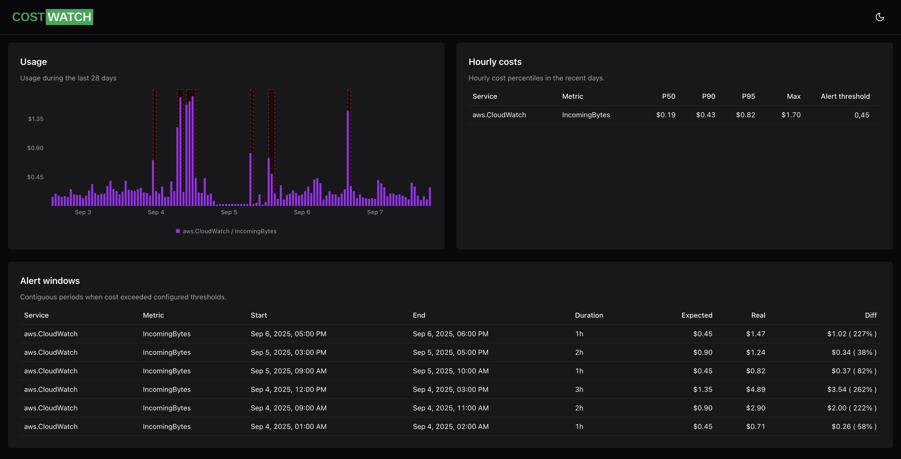

# CostWatch

CostWatch pulls usage metrics (e.g., from AWS CloudWatch), stores them in ClickHouse, and exposes an API and dashboard for cost analysis and projections.



## Quick start (Docker)

Prerequisite: Docker Desktop (or Docker Engine) installed and running.

1) Clone the repo and change into the project folder:

```shell
git clone https://github.com/magicbell/costwatch
cd costwatch
```

2) Start the full stack:

```shell
docker compose up
```

3) Visit the dashboard at http://localhost:3000

Press Ctrl+C to stop. To run in the background: `docker compose up -d` and stop with `docker compose down`.

## AWS authentication

CostWatch talks to AWS (e.g., CloudWatch) through the standard AWS SDK credential chain. Ensure your AWS credentials are available in the environment where the API/worker run.

Common ways this works:
- AWS SSO: log in with `aws sso login` for your profile; the SDK will pick up your session from your AWS config/credentials files.
- Shared credentials/config files: `~/.aws/credentials` and `~/.aws/config`.
- Environment variables: `AWS_ACCESS_KEY_ID`, `AWS_SECRET_ACCESS_KEY`, and, when applicable, `AWS_SESSION_TOKEN`.

Verify your identity with the AWS CLI:

```bash
aws sts get-caller-identity
```

If you are running via Docker, make sure the containers can access your credentials (for example, by exporting the env vars before `docker compose up`, or by mounting your `~/.aws` directory if that matches your workflow).

## Receiving alerts

Alerts are optional and can be posted to a Slack‑compatible incoming webhook.

- Set `WEBHOOK_URL` in your `.env` to your webhook URL (for example, a Slack Incoming Webhook). The notifier posts a simple JSON payload like `{ "text": "..." }`, which is also compatible with many Slack‑compatible systems (e.g., Mattermost, Rocket.Chat).
- Bring the stack up with `docker compose up` (compose loads `.env` for the api/worker).
- Configure alert rules in the dashboard (Hourly costs card, Alert threshold
column). When thresholds are exceeded, the worker will send notifications to WEBHOOK_URL.
- For ongoing incidents, alerts will be sent at most once an hour.

Tip: you can copy the provided example and then edit it:

```shell
cp example.env .env
# open .env and set WEBHOOK_URL=https://hooks.slack.com/services/...
```

## Contributing / local development

See [CONTRIBUTING.md](/CONTRIBUTING.md) for a workflow that runs services locally (without Docker) and provides convenient tasks for development.

## Troubleshooting

- Ports 3000, 3010, 3020, 9000, or 8123 already in use:
  - Stop other processes using these ports or change the mappings in docker-compose.yml
- The first run takes a while:
  - Docker may need to pull base images; later runs will be faster
- Dashboard can't reach API from Docker:
  - The dashboard container generates its client pointing to http://localhost:3010/v1 and should just work via compose networking; ensure the API is up and healthy
